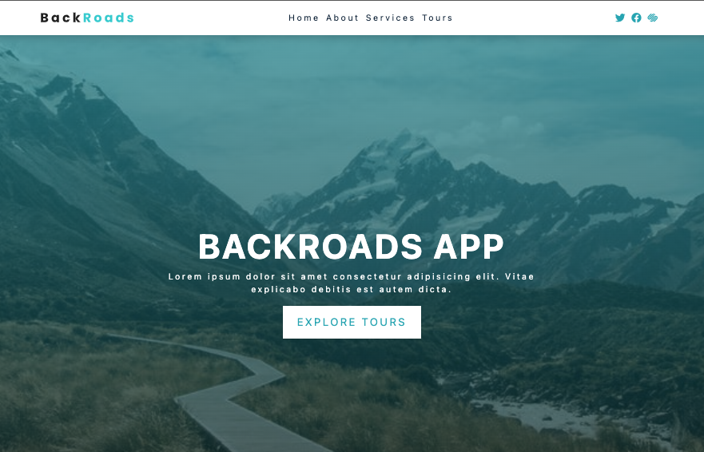

#Wokring into a landing page

The Navbar Section we are useing an array working with *HREF & ID* 
Check the data.js file

---
### [Check here!](https://backroad-apps.netlify.app/)

[BackRoads App](https://github.com/Davidcastel26/Backroads-Project)

---

